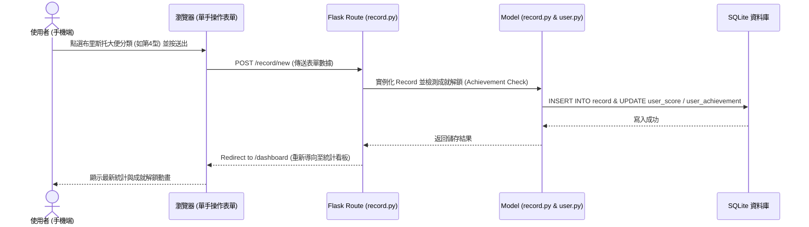
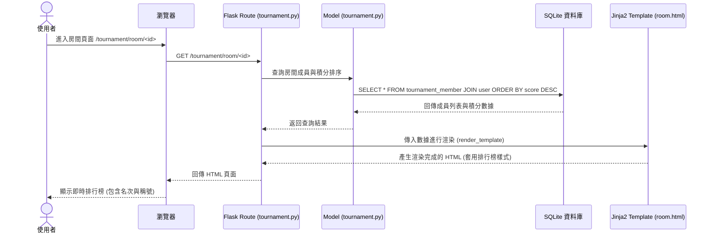

# 系統架構設計文件 (ARCHITECTURE) - 拉屎冠軍爭霸賽系統

本專案是一個基於 Python Flask 框架開發的 Web 應用程式。為了配合在馬桶上單手操作的特殊情境，前端將採用響應式（Mobile-First）設計與靈活的 CSS 排版，後端透過 Jinja2 進行頁面渲染，並配合 SQLite 資料庫儲存資料。

---

## 1. 技術架構說明

### 選用技術與原因
- **後端 (Backend)**: **Flask (Python)** — 輕量、模組化且易於擴充，非常適合本專案中包含多個功能模組（會員、記錄、排行榜、成就）的快速開發。
- **模板引擎 (Template Engine)**: **Jinja2** — Flask 預設的模板引擎，實現後端邏輯與前端介面的無縫結合（伺服器端渲染），避免了前後端分離（如 React/Vue）帶來的 API 開發複雜度，加速 MVP 的產出。
- **資料庫 (Database)**: **SQLite** — 輕量級關聯式資料庫，無需安裝與設定繁瑣的資料庫伺服器，直接讀寫本機檔案（`instance/database.db`），且完全足夠支撐中小型社群拉屎競賽的數據規模。
- **前端樣式 (Styling)**: **Vanilla CSS + CSS Variables** — 不使用 TailwindCSS。我們將使用原生 CSS，搭配自訂的色調變數（如 HSL 色彩系統）與 Flexbox/Grid 佈局，打造高度客製化、動態且極致流暢的手機端操作介面。
- **圖表庫 (Charts)**: **Chart.js (CDN)** — 輕量級 Javascript 視覺化圖表庫，可在前端將 SQLite 查詢出的排便歷史數據轉化為直觀的圓餅圖與趨勢圖。

### Flask MVC 模式說明
本專案遵循傳統的 MVC (Model-View-Controller) 設計模式：
- **M (Model - 模型)**: 位於 `app/models/`，負責定義資料庫 Schema、資料表關聯（User, Record, Tournament, Achievement），以及與資料庫存取的商業邏輯。
- **V (View - 視圖)**: 位於 `app/templates/`，由 HTML5 加上 Jinja2 語法所組成的模板。負責將 Controller 傳入的數據渲染成最終瀏覽器呈現的畫面。
- **C (Controller - 控制器/路由)**: 位於 `app/routes/`，負責接收瀏覽器的 HTTP 請求，調用對應的 Model 進行資料庫查詢或寫入，並將結果送至 Jinja2 進行頁面渲染後回傳給使用者。

---

## 2. 專案資料夾結構

專案採用 Flask Blueprint（藍圖）結構，將不同功能模組進行模組化拆分：

```text
poopoo/
├── app/
│   ├── __init__.py           # 初始化 Flask App、資料庫並註冊 Blueprint 路由
│   ├── models/               # 資料庫模型 (M)
│   │   ├── __init__.py
│   │   ├── user.py           # 使用者與帳號資料表
│   │   ├── record.py         # 排便歷史記錄資料表
│   │   ├── tournament.py     # 爭霸賽房間與成員關聯表
│   │   └── achievement.py    # 成就設定與解鎖紀錄表
│   ├── routes/               # Flask 路由控制器 (C)
│   │   ├── __init__.py
│   │   ├── auth.py           # 會員註冊、登入與登出
│   │   ├── record.py         # 單手快速排便紀錄表單、歷史列表
│   │   ├── dashboard.py      # 排便數據視覺化統計看板
│   │   ├── tournament.py     # 好友爭霸賽與排行榜
│   │   └── achievement.py    # 成就稱號展示
│   ├── static/               # 前端靜態資源
│   │   ├── css/
│   │   │   └── style.css     # 主題色系、手機單手排版、動畫與樣式
│   │   └── js/
│   │       ├── main.js       # 表單大拇指滑動選擇器與互動邏輯
│   │       └── charts.js     # 看板 Chart.js 圖表渲染
│   └── templates/            # Jinja2 HTML 模板 (V)
│       ├── base.html         # 全域基礎佈局（包含單手好按的底部導覽列）
│       ├── auth/
│       │   ├── login.html    # 登入頁面
│       │   └── register.html # 註冊頁面
│       ├── record/
│       │   ├── new.html      # 快速排便紀錄（布里斯托單手點選介面）
│       │   └── history.html  # 歷史紀錄列表
│       ├── dashboard/
│       │   └── index.html    # 排便數據視覺化統計看板
│       ├── tournament/
│       │   ├── list.html     # 爭霸賽大廳（創建/加入房間）
│       │   └── room.html     # 房間詳情與即時排行榜
│       └── achievement/
│           └── list.html     # 成就解鎖進度與稱號設定
├── database/
│   └── schema.sql            # 初始化資料庫的 SQL 語法備份
├── docs/
│   ├── PRD.md                # 產品需求文件
│   └── ARCHITECTURE.md       # 本系統架構設計文件 (本檔)
├── instance/
│   └── database.db           # SQLite 本機資料庫（Flask 自動生成，不納入 Git）
├── .gitignore
├── app.py                    # 系統進入點 (Run Server)
├── requirements.txt          # Python 依賴套件清單
└── README.md
```

---

## 3. 元件關係圖

以下是本系統的核心資料與控制流向：

### 數據寫入流程（如：新增排便紀錄）


### 數據讀取流程（如：查看爭霸賽排行榜）


---

## 4. 關鍵設計決策

### 決策 1：Thumb Zone (大拇指熱區) 與底部導覽列排版
*   **原因**：考量到使用者上廁所時通常單手持機（另一手可能拿報紙、手機或衛生紙），所有的互動元件必須放置於「大拇指輕鬆觸碰區域」（螢幕下半部 60% 區間）。
*   **作法**：
    1. 放棄傳統的頂部導覽列，改用類似 App 的 **固定底部導覽列 (Bottom Navigation Bar)**。
    2. 表單提交按鈕、布里斯托分類選擇器皆置於螢幕底部，並具有超大點擊熱區。
    3. 表單內不需要滑動輸入或複雜打字，純粹依靠大圖示點選。

### 決策 2：布里斯托大便分類介面 (動態橫向選單)
*   **原因**：布里斯托大便分類法共有 1 到 7 型。若在手機上垂直條列會佔據太多版面，導致使用者必須上下捲動；若並排又會因為按鈕太小而難以單手點選。
*   **作法**：採用 **卡片式橫向滾動選擇器 (Horizontal Scroll Picker)**，或是 **弧形轉盤 (Arc Dial)** 設計。每個類型做成一張大卡片，以色彩區分（便秘-紅色、健康-綠色、腹瀉-藍色），大拇指左右滑動即可快速點選，並有觸覺/動態震動反饋（利用 JS Haptic Feedback API）。

### 決策 3：輕量化無前端框架架構
*   **原因**：避免專案複雜化，且使載入速度最大化。在訊號不佳的廁所中，高載入速度是極致體驗的關鍵。
*   **作法**：不使用 npm、React、Webpack 等複雜建置工具。直接使用 Flask + Jinja2 進行 SSR (Server-Side Rendering)，並引進最少量的 CDN（如 Chart.js 與 FontAwesome 圖示庫），讓整個應用程式頁面大小維持在數百 KB 內，瞬間載入。

### 決策 4：成就檢測非同步化設計（未來考量）與主動觸發
*   **原因**：每當使用者拉完屎，希望能即時得知是否解鎖成就，但成就條件（如：連續3天相同時間）需要掃描歷史紀錄，可能會拉長表單送出時間。
*   **作法**：在 Model 寫入 Record 時，以輕量級 Helper 函數在同一個資料庫交易中完成快速檢測。若解鎖，則將成就資訊寫入 Session，並在轉導後的頁面（View）彈出慶祝視窗，保證回饋的即時性與資料一致性。
