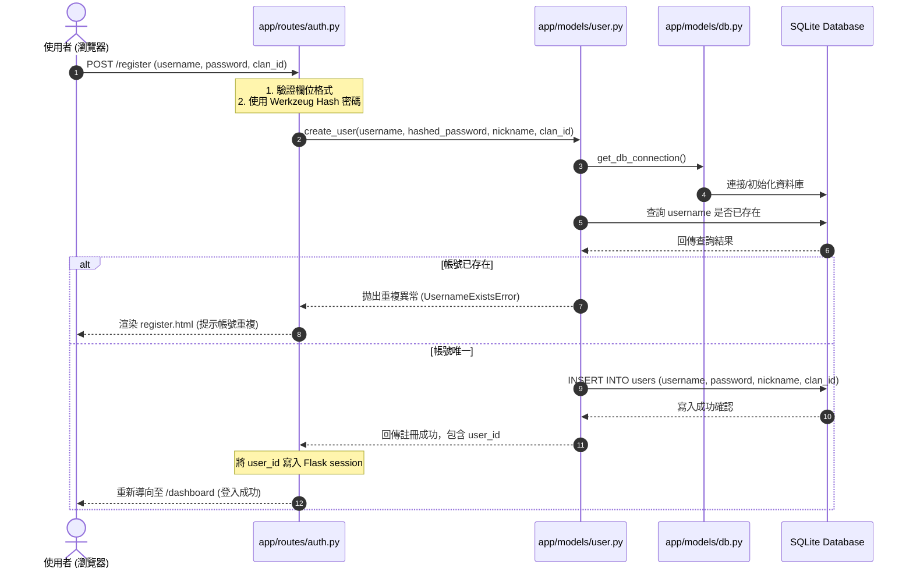

# [拉屎冠軍爭霸賽] 會員與戰隊系統 — 系統架構設計文件 (ARCHITECTURE)

> [!NOTE]
> 本架構文件依據 [產品需求文件 (PRD)](file:///c:/Users/User/Desktop/poopoo/docs/PRD.md) 制定，規劃「會員註冊與戰隊資料庫關聯系統」的技術架構、目錄結構、元件關係以及核心設計決策。本專案採用 **Flask 輕量級 MVC 架構模式**。

---

## 1. 技術架構說明

本系統為無分前後端的整合型 Web 應用程式，使用 Flask 作為核心控制器，Jinja2 作為視圖渲染引擎，SQLite 作為輕量級關係型資料庫。

```
                       ┌──────────────────────────────────────┐
                       │               瀏覽器                 │
                       └───────────┬──────────────▲───────────┘
                                   │              │
                           (HTTP POST/GET)  (HTML 渲染頁面)
                                   │              │
                       ┌───────────▼──────────────┴───────────┐
                       │             Flask 後端               │
                       │   (app.py / Controller / Routes)     │
                       └───────────┬──────────────▲───────────┘
                                   │              │
                             (Model 查詢)    (資料庫實體)
                                   │              │
  ┌────────────────────────────────▼──────────────┴────────────────────────────────┐
  │                                    Model 層                                    │
  │     ┌────────────────────────┐            ┌────────────────────────┐           │
  │     │   User Model (用戶)    │            │   Clan Model (戰隊)    │           │
  │     └───────────┬────────────┘            └───────────┬────────────┘           │
  └─────────────────┼─────────────────────────────────────┼────────────────────────┘
                    │                                     │
                    │         (SQL Raw Query)             │
                    └─────────────────┬───────────────────┘
                                      │
                       ┌──────────────▼───────────┐
                       │          SQLite          │
                       │   (instance/database.db) │
                       └──────────────────────────┘
```

### MVC 職責分配

- **Model (模型層)**：位於 `app/models/`。
  - 職責：負責資料的結構定義，並封裝與資料庫（SQLite）進行互動的邏輯。
  - 核心處理：密碼的 `generate_password_hash` 與對比 `check_password_hash`、將新使用者寫入 `users` 表格，並與 `clans` 戰隊關聯。
- **View (視圖層)**：位於 `app/templates/`。
  - 職責：負責前端頁面的排版與展示，採用 **Jinja2 模板引擎** 進行動態資料渲染。
  - 核心處理：將 Flask 傳入的登入狀態、戰隊清單、閃退提示訊息（Flash Messages）呈現在網頁中。
- **Controller / Routes (控制器與路由)**：位於 `app/routes/`。
  - 職責：負責接收瀏覽器的 HTTP 請求，調用對應的 Model 進行邏輯處理，最後選擇對應的 Jinja2 模板渲染返回給瀏覽器。
  - 核心路由：
    - `GET /register`：展示註冊與戰隊選擇表單。
    - `POST /register`：處理註冊表單提交、密碼雜湊、呼叫 User Model 進行寫入。
    - `POST /join-clan`：處理登入狀態下使用者選擇或更換戰隊的動作。

---

## 2. 專案資料夾結構

專案目錄結構遵循模組化 Flask 最佳實踐，確保高內聚、低耦合，方便組員分工開發：

```text
poopoo/
│
├── app/                        # 應用程式主核心目錄
│   ├── __init__.py             # 初始化 App Factory，建立 Flask 實體與註冊 Blueprint
│   │
│   ├── models/                 # Model 層：資料庫交互邏輯
│   │   ├── __init__.py         # 匯出資料庫連接函數
│   │   ├── db.py               # 資料庫低階連接與初始化 (SQLite3 封裝)
│   │   ├── user.py             # User 模型（用戶註冊、驗證、戰隊綁定）
│   │   └── clan.py             # Clan 模型（讀取戰隊資料、戰隊人數計算）
│   │
│   ├── routes/                 # Controller 層：路由與邏輯分發
│   │   ├── __init__.py
│   │   ├── auth.py             # 註冊與登入路由 (/register, /login, /logout)
│   │   ├── clan.py             # 戰隊管理與切換路由 (/join-clan, /clans)
│   │   └── main.py             # 個人儀表板與首頁 (/dashboard)
│   │
│   ├── static/                 # 靜態資源
│   │   ├── css/
│   │   │   └── style.css       # 核心設計系統：高質感黑金/綠金和風或潮流配色與動畫
│   │   ├── js/
│   │   │   └── main.js         # 前端防呆校驗與微動畫效果
│   │   └── images/             # 戰隊圖章、LOGO 等
│   │
│   └── templates/              # View 層：Jinja2 動態 HTML 模板
│       ├── base.html           # 骨架基礎模板（含導覽列、頁尾、Flash 訊息提示）
│       ├── index.html          # 首頁 / 個人儀表板
│       ├── login.html          # 會員登入頁面
│       └── register.html       # 會員註冊兼戰隊選擇頁面
│
├── database/                   # 資料庫定義與初始化腳本
│   └── schema.sql              # 儲存資料庫結構（DDL），用於建立 Table
│
├── docs/                       # 設計文件目錄
│   ├── PRD.md                  # 產品需求文件
│   └── ARCHITECTURE.md         # 系統架構設計文件 (本檔案)
│
├── instance/                   # 存放運行時生成的實體資料 (不追蹤進 Git)
│   └── database.db             # 實際運行的 SQLite 資料庫
│
├── app.py                      # 系統啟動入口
├── requirements.txt            # Python 依賴套件清單 (Flask, Werkzeug 等)
└── README.md                   # 專案快速啟動指南
```

---

## 3. 元件關係與資料流圖

### 會員註冊與戰隊綁定資料流 (Registration & Clan Binding Flow)
當使用者在註冊頁面點選戰隊並送出註冊表單時，系統元件間的協同調用關係如下：



---

## 4. 關鍵設計決策

為了確保本系統開發的高效與安全，我們制定了以下四項關鍵技術決策：

### 決策一：資料庫連接與交易安全 (SQLite Connection via Thread-Local)
- **原因與細節**：SQLite 在多執行緒的 Flask 中共用同一個連線會導致併發衝突。我們將使用 Flask 的 `g` 物件（`flask.g`）封裝資料庫連線。在每次請求開始時（`before_request` 或延遲加載）開啟連線，並在請求結束時（`teardown_appcontext`）自動關閉，以確保資料庫資源不會外洩，且支援 Transaction 交易安全。

### 決策二：戰隊寫入的資料完整性 (Foreign Key Constraints)
- **原因與細節**：為了防止使用者被寫入不存在的 `clan_id`，我們在 SQLite 中明確啟用外鍵限制。在連接 SQLite 時，主動執行 `PRAGMA foreign_keys = ON;`，確保 `users.clan_id` 必定對應 `clans.id`，從資料庫層面杜絕垃圾資料的產生。

### 決策三：Werkzeug 密碼安全防護 (Security Hashing)
- **原因與細節**：使用 Flask 內建的 `werkzeug.security` 中的 `generate_password_hash` (採用 PBKDF2 With SHA256 加鹽演算法) 與 `check_password_hash`。此方案無須額外編譯 C 依賴套件（如 bcrypt），相容性極高，且防範彩虹表與暴力破解攻擊。

### 決策四：Blueprint (藍圖) 模組化設計
- **原因與細節**：我們不將所有路由塞在 `app.py` 中，而是透過 Blueprint 將路由分組（`auth_bp`、`clan_bp`、`main_bp`），這樣組員 A 與組員 B 可以在不同的檔案（`routes/auth.py` 和 `routes/clan.py`）中獨立開發，避免嚴重的 Git Merge Conflict。

---
*本架構文件由 Antigravity 輔助建構，旨在為「拉屎冠軍爭霸賽」的系統元件交互提供清晰的物理藍圖。*
