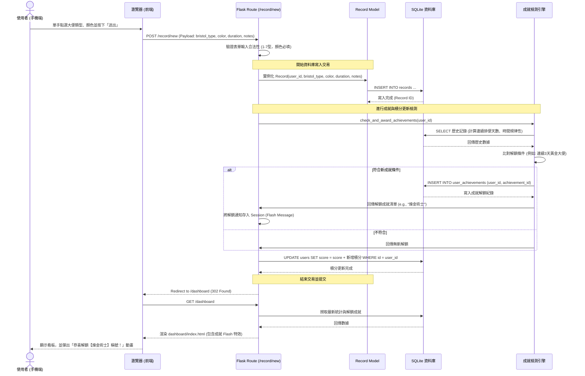

# 系統流程圖與路由對照文件 (FLOWCHART)

本文件描述了「拉屎冠軍爭霸賽系統」的使用者操作流程（User Flow）、核心系統序列圖（Sequence Diagram）以及功能路由對照表。

---

## 1. 使用者流程圖 (User Flow)

此流程圖描述使用者從打開瀏覽器，到進行排便記錄、查看統計、參與爭霸賽及解鎖成就的完整操作路徑。

```mermaid
flowchart TD
    Start([使用者開啟網頁]) --> AuthCheck{是否已登入？}
    
    AuthCheck -- 否 --> Login[登入頁面 /auth/login]
    Login --> Register[註冊帳號 /auth/register]
    Register --> Login
    Login -- 登入成功 --> Dashboard[統計看板 /dashboard]
    
    AuthCheck -- 是 --> Dashboard
    
    Dashboard --> NavChoice{要執行什麼操作？}
    
    %% 快速排便記錄流程
    NavChoice -->|大拇指按下方 + 號| RecordForm[快速紀錄表單 /record/new]
    RecordForm --> BristolSelect[點選布里斯托大便分類 (1-7型)]
    BristolSelect --> DetailSelect[選擇顏色 / 輸入時長及備註]
    DetailSelect --> RecordSubmit[點擊送出]
    RecordSubmit --> DBCheck{系統判定與儲存}
    DBCheck -->|若達成成就條件| AchievementPopup[解鎖成就通知]
    AchievementPopup --> DashboardRedirect[重導向至 /dashboard]
    DBCheck -->|無新解鎖成就| DashboardRedirect
    
    %% 爭霸賽與排行榜流程
    NavChoice -->|點選「爭霸賽」| TournamentList[爭霸賽房間列表 /tournament]
    TournamentList --> RoomChoice{選擇操作}
    RoomChoice -->|創建房間| CreateRoom[輸入房間名並創建]
    RoomChoice -->|加入房間| JoinRoom[輸入房間邀請碼並加入]
    RoomChoice -->|查看房間| RoomDetail[房間詳情與即時排行榜 /tournament/room/id]
    CreateRoom --> RoomDetail
    JoinRoom --> RoomDetail
    
    %% 個人歷史記錄流程
    NavChoice -->|點選「歷史」| RecordHistory[排便歷史清單 /record/history]
    RecordHistory --> EditDelete{修改記錄}
    EditDelete -->|刪除| DeleteRecord[刪除該筆排便記錄]
    
    %% 成就與稱號流程
    NavChoice -->|點選「成就」| AchievementList[成就與稱號頁面 /achievement]
    AchievementList --> EquipTitle[更換已解鎖的個人稱號]
    EquipTitle --> ProfileUpdate[更新個人檔案顯示]
```

---

## 2. 系統序列圖 (Sequence Diagram)

本圖詳細描述使用者在手機端填寫「快速排便紀錄表單」並送出時，瀏覽器、Flask 後端、資料庫與成就模組之間的交互作用。



---

## 3. 功能清單與路由對照表

以下是系統規畫實作的所有路由與對應方法：

| 功能模組 | 功能名稱 | URL 路徑 | HTTP 方法 | 視圖模板 (Template) | 說明 |
| :--- | :--- | :--- | :--- | :--- | :--- |
| **會員管理** | 註冊頁面 / 提交註冊 | `/auth/register` | `GET`, `POST` | `auth/register.html` | 使用者建立帳號 |
| | 登入頁面 / 提交登入 | `/auth/login` | `GET`, `POST` | `auth/login.html` | 會員身分驗證 |
| | 登出 | `/auth/logout` | `POST` | 無 (重導向至登入頁) | 清除 Session |
| **排便記錄** | 新增記錄頁面 | `/record/new` | `GET` | `record/new.html` | 手機單手優化 Bristol 點選表單 |
| | 提交排便記錄 | `/record/new` | `POST` | 無 (重導向至 Dashboard) | 儲存紀錄、檢測成就與計算積分 |
| | 排便歷史列表 | `/record/history` | `GET` | `record/history.html` | 列出使用者個人的排便歷史 |
| | 刪除排便記錄 | `/record/delete/<int:id>`| `POST` | 無 (重導向至 history) | 刪除單筆紀錄，更新對應積分 |
| **數據統計** | 首頁統計看板 | `/dashboard` | `GET` | `dashboard/index.html` | 呈現圖表與摘要健康指標 |
| **爭霸賽系統**| 爭霸賽大廳 | `/tournament` | `GET` | `tournament/list.html` | 顯示已加入的房間與創建/加入選項 |
| | 創建爭霸賽房間 | `/tournament/create` | `POST` | 無 (重導向至房間詳情) | 建立新比賽並生成隨機邀請碼 |
| | 加入爭霸賽房間 | `/tournament/join` | `POST` | 無 (重導向至房間詳情) | 輸入邀請碼加入好友的比賽房間 |
| | 房間詳情與排行榜 | `/tournament/room/<int:id>`| `GET`| `tournament/room.html` | 查看房間內的成員積分排名 |
| **成就系統** | 成就列表與稱號設定| `/achievement` | `GET` | `achievement/list.html` | 顯示解鎖進度，提供更換稱號介面 |
| | 配備/更換稱號 | `/achievement/equip` | `POST` | 無 (重導向至成就頁面) | 設定個人顯示的拉屎頭銜 |
